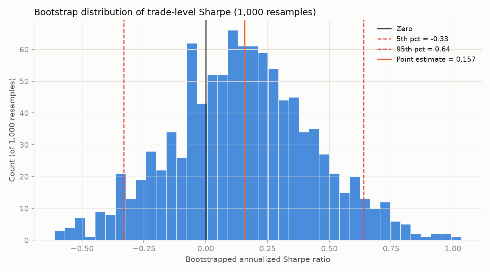

# Statistical Significance Report: Final Config

Config: **lookback=20d, threshold=2.0%**, fixed reversal direction, 1-day hold, $0.005/share commission + 0.05% slippage, $100,000 account -- the single best (and only profitable-after-costs) config from `results/backtest_results.csv`, already stress-tested in `results/robustness_report.md`. Train+validation only; holdout untouched.

## 1. T-test: mean daily strategy return vs. zero

n = 3145 daily returns from the backtest's equity curve. Mean daily return = 0.0179%, std = 1.8057%.

- **t-statistic: 0.556**
- **two-sided p-value: 0.5784**
- **Not significant** at the 5% level (mean daily return is not statistically distinguishable from zero).

This is consistent with everything found so far: the baseline's CAGR was already under half a percent (`results/backtest_results.csv`), and `results/robustness_report.md` found the config profitable in only 2 of 4 sub-periods and fragile to +/-20% parameter perturbation. A t-test failing to reject the null here is not a new finding so much as the same thin-edge conclusion stated in a different, standard statistical form.

## 2. Bootstrap distribution of trade-level Sharpe ratios

1384 trades resampled with replacement, 1000 iterations (seed=42). Each iteration's Sharpe is annualized by sqrt(trades/year) = sqrt(110.9), since these are per-trade, not per-day, returns.

- Point-estimate Sharpe (actual trade sequence, no resampling): **0.157**
- Bootstrap mean Sharpe: 0.151 (std: 0.283)
- **5th percentile: -0.331**
- 50th percentile (median): 0.151
- **95th percentile: 0.639**
- Fraction of bootstrap iterations with Sharpe > 0: 70.5%

The 5th-95th percentile bootstrap interval [-0.331, 0.639] **straddles zero**, meaning resampling the same 1384 trades with replacement produces both clearly negative and clearly positive Sharpe outcomes depending on which trades happen to be over- or under-sampled -- the point estimate's sign is not resampling-stable.

Caveat: bootstrapping trades with replacement assumes trades are exchangeable/i.i.d., which ignores any time-ordering or regime structure (e.g. the concentration in 2006-2009 and 2015-2018 found in `results/robustness_report.md`) -- it tests "how much does the Sharpe estimate wobble under resampling of this exact trade set," not "would this hold up out of sample." A wide or zero-straddling interval is still an honest, useful warning sign even though the assumption is imperfect.

## Bottom line

- T-test: mean daily return is not statistically distinguishable from zero (p=0.578).
- Bootstrap: 90% interval for annualized trade-level Sharpe is [-0.33, 0.64], straddling zero.

Combined with the walk-forward grid search's optimism (Step 9), the fixed-direction backtest's thin margin (Step 11), and the fragility found under parameter/cost/sub-period stress (robustness report), this config does not clear a reasonable bar for statistical significance. Nothing here touches the holdout split -- these are all still train+validation diagnostics.
